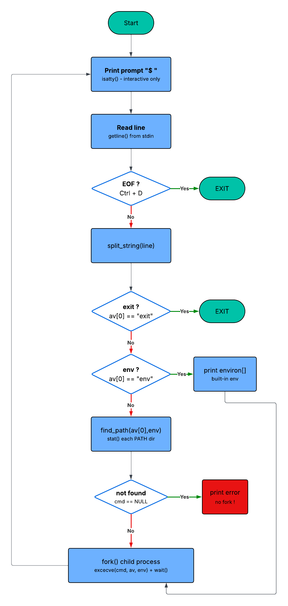

## Holberton Simple Shell (HSS)

A simple UNIX command line interpreter written in C, built as part of the Holberton School curriculum.


## 📚 Table of Contents

<details>
<summary>📖 Click to expand</summary>

<br>

* 📟 [Technologies used](https://github.com/sagalou/holbertonschool-simple_shell/tree/dev?tab=readme-ov-file#technologies-used)
* 📖 [Description](https://github.com/sagalou/holbertonschool-simple_shell/tree/dev?tab=readme-ov-file#-description)
* 🔄 [Flowchart](https://github.com/sagalou/holbertonschool-simple_shell/blob/dev/flowchart.md)
* 🔧 [Prerequisites](https://github.com/sagalou/holbertonschool-simple_shell/tree/dev?tab=readme-ov-file#prerequisites)
* ⚙️ [Installation](https://github.com/sagalou/holbertonschool-simple_shell/tree/dev?tab=readme-ov-file#-description)
* 🛠️ [Compilation](https://github.com/sagalou/holbertonschool-simple_shell/tree/dev?tab=readme-ov-file#%EF%B8%8F-compilation)
* ▶️ [Usage](https://github.com/sagalou/holbertonschool-simple_shell/tree/dev?tab=readme-ov-file#%EF%B8%8F-usage)
* 📘 [Manual](https://github.com/sagalou/holbertonschool-simple_shell/blob/dev/README.md#-manual)
* ⚠️ [Limitations](https://github.com/sagalou/holbertonschool-simple_shell/blob/dev/README.md#%EF%B8%8F-limitations)
* 🧪 [Valgrind](https://github.com/sagalou/holbertonschool-simple_shell/blob/dev/README.md#-valgrind)
* ✨ [Features](https://github.com/sagalou/holbertonschool-simple_shell/tree/dev?tab=readme-ov-file#features)
* 🗂️ [Project Structure](https://github.com/sagalou/holbertonschool-simple_shell/tree/dev?tab=readme-ov-file#%EF%B8%8F-project-structure)
* 👨‍💻 [Authors](https://github.com/sagalou/holbertonschool-simple_shell/tree/dev?tab=readme-ov-file#%E2%80%8D-authors)
* 👥 [Acknowledgements](https://github.com/sagalou/holbertonschool-simple_shell/tree/dev?tab=readme-ov-file#-additionals)


WIP

* []()

</details>

## 📟 Technologies used


## 📖 Description
`hsh` is a simple shell that reads commands from standard input and executes them,
in both interactive and non-interactive mode.

## 🔄 Flowchart
```text
┌─────────────────┐
│      START      │
└────────┬────────┘
         │
         ▼
┌─────────────────────┐
│   Display prompt    │
│        "$ "         │
└────────┬────────────┘
         │
         ▼
┌─────────────────────┐
│    Read command     │
│     getline()       │
└────────┬────────────┘
         │
         ▼
◇─────────────◇
◇    EOF ?    ◇──── yes ──→ ┌─────────┐
◇─────────────◇             │  EXIT   │
         │ no               └─────────┘
         ▼
┌─────────────────────┐
│   split_string()    │
│      → av[]         │
└────────┬────────────┘
         │
         ▼
◇──────────────────────◇
◇  av[0] == "exit" ?   ◇── yes ──→ ┌─────────┐
◇──────────────────────◇           │  EXIT   │
         │ no                       └─────────┘
         ▼
◇─────────────────────◇
◇  av[0] == "env" ?   ◇── yes ──→ ┌───────────────┐
◇─────────────────────◇           │ print environ │
         │ no                      └───────────────┘
         ▼
┌─────────────────────┐
│     find_path()     │◄──────────────────┐
│  stat() each dir    │                   │
└────────┬────────────┘                   │
         │                                │
         ▼                                │
◇──────────────◇                          │
◇  cmd == NULL ? ◇── yes ──→ ┌──────────────┐
◇──────────────◇            │ print error  │
         │ no               │  (no fork!)  │
         ▼                  └──────┬───────┘
┌──────────────────────────┐       │
│ fork() + execve() + wait()│◄─────┘
└────────────┬─────────────┘
             │
             ▼
      ↻ Back to prompt
```

## 🖼️ Picture



---

## Getting Started

## 🔧 Prerequisites

Before starting, ensure you have:

| Requirement | Details |
|------------|--------|
| OS | Linux / Unix-based system (Ubuntu 20.04+ recommended) |
| Compiler | `gcc` (-Wall -Werror -Wextra -pedantic -std=gnu89) |
| Standard | `gnu89` |
| Libraries | glibc |
| Tools | `git`, `valgrind` |
| Permissions | Ability to compile and execute binaries |
| Betty | Betty code style compliant |

---

## ⚙️ Installation

## 📋 Clone the repository

```bash
git clone https://github.com/sagalou/holbertonschool-simple_shell.git
```

## 📁 Navigate into the directory

```bash
cd holbertonschool-simple_shell
```

## 🛠️ Compilation

```bash
gcc -Wall -Werror -Wextra -pedantic -std=gnu89 *.c -o hsh
```

## ▶️ Usage

```bash
./hsh
```

**Interactive mode:**
$ ./hsh
($) /bin/ls
($) exit

**Non-interactive mode:**
$ echo "/bin/ls" | ./hsh

## 📘 Manual

Missing features

No pipes (ls | grep foo) — only one command at a time
No redirections (>, <, >>, 2>)
No command chaining (;, &&, ||)
No quotes or escape characters ("hello world", \', \n)
No variable expansion ($HOME, $?, $$)
No wildcards / globbing (*.c, ?)
No relative path execution (./script.sh) — only absolute paths or commands found via PATH
No command history (up/down arrows)
No tab-completion
No shell script support (e.g. ./hsh script.sh)

Missing builtins

No cd — cannot change directory
exit does not accept an exit code (exit 1)

## ⚠️ Limitations

Missing features

No pipes (ls | grep foo) — only one command at a time
No redirections (>, <, >>, 2>)
No command chaining (;, &&, ||)
No variable expansion ($HOME, $?, $$)
No relative path execution (./script.sh) — only absolute paths or commands found via PATH
No command history (up/down arrows)
No shell script support (e.g. ./hsh script.sh)

Missing builtins

No cd — cannot change directory
No pwd
No echo
No export / unset to modify the environment
exit does not accept an exit code (exit 1)

Robustness

No handling of very long lines
split_string does not handle multiple spaces or tabs between words
No SIGINT handling (Ctrl+C) — the shell inherits default behavior from the child process
find_path allocates with strdup but cmd is never freed in the parent after wait


## 🧪 Valgrind

==2833== Memcheck, a memory error detector
==2833== Copyright (C) 2002-2022, and GNU GPL'd, by Julian Seward et al.
==2833== Using Valgrind-3.22.0 and LibVEX; rerun with -h for copyright info
==2833== Command: ./hsh
==2833== 
$ ls
AUTHORS  README.md  builtins.c  env.c  find_path.c  flowchart.md  flowchart.png  hsh  main.c  main.h  man_1_simple_shell  shell.c
$ pwd
/home/kevin/projets/holberton/holbertonschool-simple_shell
$ env
PYTHON_BASIC_REPL=1
LESSOPEN=| /usr/bin/lesspipe %s
USER=kevin
GIT_ASKPASS=/home/kevin/.vscode-server/bin/560a9dba96f961efea7b1612916f89e5d5d4d679/extensions/git/dist/askpass.sh
SHLVL=1
LD_LIBRARY_PATH=/usr/lib/debug
HOME=/home/kevin
TERM_PROGRAM_VERSION=1.116.0
VSCODE_IPC_HOOK_CLI=/run/user/1000/vscode-ipc-d77fbc42-c65d-40bf-b7c6-5982638d1bfb.sock
VSCODE_GIT_ASKPASS_MAIN=/home/kevin/.vscode-server/bin/560a9dba96f961efea7b1612916f89e5d5d4d679/extensions/git/dist/askpass-main.js
PS1=\[\](.venv) \[\]\[\e]0;\u@\h: \w\a\]${debian_chroot:+($debian_chroot)}\[\033[01;32m\]\u@\h\[\033[00m\]:\[\033[01;34m\]\w\[\033[00m\]\$ \[\]\[\]
VSCODE_GIT_ASKPASS_NODE=/home/kevin/.vscode-server/bin/560a9dba96f961efea7b1612916f89e5d5d4d679/node
PYDEVD_DISABLE_FILE_VALIDATION=1
BUNDLED_DEBUGPY_PATH=/home/kevin/.vscode-server/extensions/ms-python.debugpy-2025.18.0-linux-x64/bundled/libs/debugpy
VSCODE_PYTHON_AUTOACTIVATE_GUARD=1
DBUS_SESSION_BUS_ADDRESS=unix:path=/run/user/1000/bus
COLORTERM=truecolor
WSL_DISTRO_NAME=Ubuntu
DEBUGINFOD_URLS=https://debuginfod.ubuntu.com 
WAYLAND_DISPLAY=wayland-0
LOGNAME=kevin
...
$ exit
==2833== 
==2833== HEAP SUMMARY:
==2833==     in use at exit: 136 bytes in 2 blocks
==2833==   total heap usage: 11 allocs, 9 frees, 2,264 bytes allocated
==2833== 
==2833== 16 bytes in 1 blocks are still reachable in loss record 1 of 2
==2833==    at 0x484DB80: realloc (in /usr/libexec/valgrind/vgpreload_memcheck-amd64-linux.so)
==2833==    by 0x10995C: split_string (in /home/kevin/projets/holberton/holbertonschool-simple_shell/hsh)
==2833==    by 0x1096FD: main (in /home/kevin/projets/holberton/holbertonschool-simple_shell/hsh)
==2833== 
==2833== 120 bytes in 1 blocks are still reachable in loss record 2 of 2
==2833==    at 0x4846828: malloc (in /usr/libexec/valgrind/vgpreload_memcheck-amd64-linux.so)
==2833==    by 0x48E6D84: getdelim (iogetdelim.c:65)
==2833==    by 0x109864: main (in /home/kevin/projets/holberton/holbertonschool-simple_shell/hsh)
==2833== 
==2833== LEAK SUMMARY:
==2833==    definitely lost: 0 bytes in 0 blocks
==2833==    indirectly lost: 0 bytes in 0 blocks
==2833==      possibly lost: 0 bytes in 0 blocks
==2833==    still reachable: 136 bytes in 2 blocks
==2833==         suppressed: 0 bytes in 0 blocks
==2833== 
==2833== For lists of detected and suppressed errors, rerun with: -s
==2833== ERROR SUMMARY: 0 errors from 0 contexts (suppressed: 0 from 0)

## ✨ Features

- Display a prompt and wait for user input
- Execute commands with their full path (`/bin/ls`)
- Handle errors the same way as `/bin/sh`
- Support end-of-file (Ctrl+D)

## 🗂️ Project Structure

| File | Description |
|---|---|
| `main.c` | Entry point |
| `env.c` | Print environment |
| `prompt.c` | Handle prompt display |
|||

## 👨‍💻 Authors

- Kevin Rigal (splint314) — krigal323@gmail.com
- Sagal-Louise Haider (sagalou) — sagal.louise.haider@gmail.com

## 👥 Acknowledgements

This project is part of the Holberton School curriculum.  
Special thanks to Hugo Chilemme & Sofian Messaoui for their guidance.
