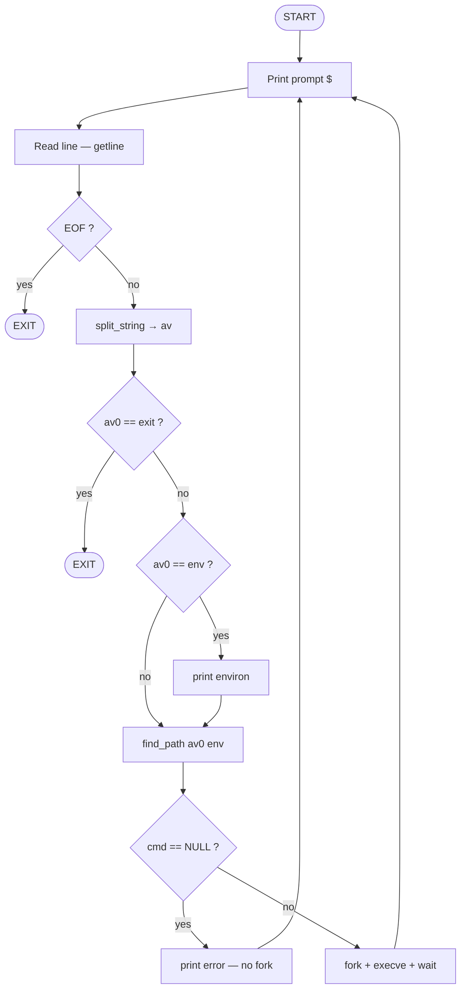

```mermaid
flowchart TD
    A([START]) --> B[Print prompt $ ]
    B --> C[Read line — getline]
    C --> D{EOF ?}
    D -->|yes| E([EXIT])
    D -->|no| F[split_string → av]
    F --> G{av0 == exit ?}
    G -->|yes| H([EXIT])
    G -->|no| I{av0 == env ?}
    I -->|yes| J[print environ]
    I -->|no| K[find_path av0 env]
    J --> K
    K --> L{cmd == NULL ?}
    L -->|yes| M[print error — no fork]
    L -->|no| N[fork + execve + wait]
    M --> B
    N --> B
```